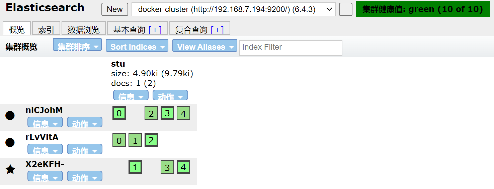

## ElasticSearch

#### 搜索方式

query string的方式


DLS（Domain specific language）的方式需要使用 json object


#### 集群文档写原理


#### 文档读原理


#### 集群部署

```shell
# 1.将elasticsearch-analysis-ik-6.4.3.zip解压到plugins目录下

# 2.直接启动
docker-compose up -d
```



