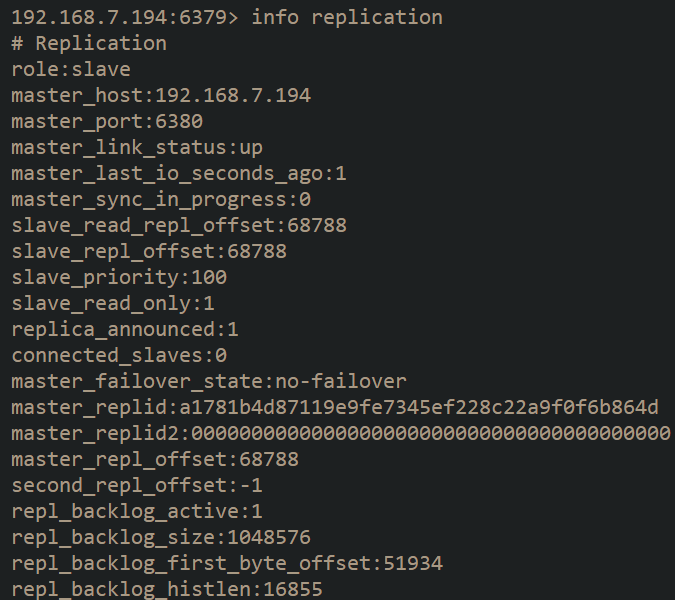

# Docker搭建Redis哨兵(采用docker方式，有网络问题)

Redis 的运行方式有四种，包括单机版，主从复制，哨兵模式，集群，单机肯定是不行的，一旦挂了连个备胎都没有，主从复制模式当 redis 主节点故障不能自动切换为备用节点，需要运维手动切换。哨兵模式使用选举策略对 master 节点进行监控，当 master 节点挂掉后，自动从 slave 节点中投票选举一个新的 master 节点出来。可以实现自动故障切换，读写分离，数据备份。集群模式主要针对数据量比较大，需要分片存储的场景。

[](https://cdn.jsdelivr.net/gh/labradors/image_repo/20220108151842.png)
本次我们在一台服务器利用 docker 搭建一个高可用方案，redis 版本为 6.0,包含如下节点

- 一个 master 节点，端口 6379
- 两个 slave 节点，端口 6380,6381
- 三个哨兵节点，端口分别为 26379,26380,26381
  真实环境中至少要保证 master 和 slave 不在一个主机上，三个哨兵不在一台主机上，可以选择一个服务，一个哨兵模式。结构图如下:

[](https://cdn.jsdelivr.net/gh/labradors/image_repo/20220108152451.png)

## 搭建主节点

### 配置 master 节点

下载 docker 镜像并配置文件

```shell
docker pull redis:6.0
mkdir -p /home/hy/foodie/redis/master/sentinel
cd  /home/hy/foodie/redis/master
vim redis.conf
```

具体配置如下:

```shell
bind 0.0.0.0
protected-mode no
port 6379
tcp-backlog 511
timeout 0
tcp-keepalive 300
# docker运行不能开启
daemonize no
# 宣布给哨兵的ip，如不配置，哨兵会取容器内部ip，这样客户端就无法访问了
replica-announce-ip "192.168.7.194"
# 宣布给哨兵的端口
replica-announce-port 6379
# 改为no,否则springboot集成后在从节点写会报错
replica-read-only no
supervised no
pidfile "/var/run/redis_6379.pid"
loglevel notice
logfile "/data/redis.log"
databases 16
always-show-logo yes
save 900 1
save 300 10
save 60 10000
stop-writes-on-bgsave-error yes
rdbcompression yes
rdbchecksum yes
dbfilename "dump.rdb"
rdb-del-sync-files no
dir "/data"
acllog-max-len 128
# 配置登录密码及master replica密码
requirepass 123456
masterauth "123456"
lazyfree-lazy-eviction no
lazyfree-lazy-expire no
lazyfree-lazy-server-del no
lazyfree-lazy-user-del no
oom-score-adj no
oom-score-adj-values 0 200 800
appendonly yes
appendfilename "appendonly.aof"
# appendfsync always
appendfsync everysec
# appendfsync no
no-appendfsync-on-rewrite no
auto-aof-rewrite-percentage 100
auto-aof-rewrite-min-size 64mb
aof-load-truncated yes
aof-use-rdb-preamble yes
lua-time-limit 5000
slowlog-log-slower-than 10000
slowlog-max-len 128
latency-monitor-threshold 0
notify-keyspace-events ""
hash-max-ziplist-entries 512
hash-max-ziplist-value 64
list-max-ziplist-size -2
list-compress-depth 0
set-max-intset-entries 512
zset-max-ziplist-entries 128
zset-max-ziplist-value 64
hll-sparse-max-bytes 3000
stream-node-max-bytes 4kb
stream-node-max-entries 100
activerehashing yes
client-output-buffer-limit normal 0 0 0
client-output-buffer-limit replica 256mb 64mb 60
hz 10
dynamic-hz yes
aof-rewrite-incremental-fsync yes
rdb-save-incremental-fsync yes
jemalloc-bg-thread yes
```

### 启动 Master Redis

```shell
docker run -itd --name=master --privileged=true --restart always -p 6379:6379 -v /home/hy/foodie/redis/master:/data redis:latest redis-server /data/redis.conf
```

### 配置 Master Sentinel

进入 sentinel 目录，vim 创建 sentinel.conf

```shell
port 26379
daemonize no
pidfile "/var/run/redis-sentinel_26379.pid"
logfile "/data/sentinel.log"
dir "/tmp"
# 注意此处三个sentinel需要两两不同
sentinel myid 004eaf91bdb084b9f1349f8570f57c231dc03060
sentinel deny-scripts-reconfig yes
sentinel monitor mymaster 192.168.7.194 6379 2
# 记住创建这个异常通知脚本并chmod给与运行权限，这个需要自己实现
# sentinel notification-script mymaster /data/notify.sh
sentinel auth-pass mymaster 123456
sentinel config-epoch mymaster 1
sentinel leader-epoch mymaster 1
#sentinel known-replica mymaster ip 6379
```

### 启动 Sentinel

```shell
docker run -itd --name=master-sentinel  --privileged=true --restart always -p 26379:26379 -v /home/hy/foodie/redis/master/sentinel:/data redis:latest redis-sentinel /data/sentinel.conf
```

## Slave1 配置

### 配置 Slave1 Redis 服务

```shell
mkdir -p /usr/local/redis/slave1/sentinel
cd  /home/hy/foodie/redis/slave1
vim redis.conf ## 配置与上面相同
```

配置文件需要在上面的配置文件的基础上修改

```shell
port 6380
pidfile "/var/run/redis_6380.pid"
replicaof 192.168.7.194 6379
# 宣布给哨兵的ip，如不配置，哨兵会取容器内部ip，这样客户端就无法访问了
replica-announce-ip "192.168.7.194"
# 宣布给哨兵的端口
replica-announce-port 6380
```

### 启动 Slave1 Redis

```shell
## 启动脚本,更改名称端口
docker run -itd --name=slave1 --privileged=true --restart always -p 6380:6380 -v /home/hy/foodie/redis/slave1:/data redis:latest redis-server /data/redis.conf
```

### 配置 sentinel

```shell
port 26380
daemonize no
pidfile "/var/run/redis-sentinel_26380.pid"
sentinel myid 004eaf91bdb084b9f1349f8570f57c231dc03061
```

### 启动 sentinel

```shell
docker run -itd --name=slave1-sentinel --privileged=true --restart always -p 26380:26380 -v /home/hy/foodie/redis/slave1/sentinel:/data redis:latest redis-sentinel /data/sentinel.conf
```

## Slave2 配置

### 配置 Slave2 Redis 服务

```shell
mkdir -p /home/hy/foodie/redis/slave2/sentinel
cd  /home/hy/foodie/redis/slave2
vim redis.conf ## 配置与上面相同
```

配置文件需要在上面的配置文件的基础上修改

```shell
port 6381
pidfile "/var/run/redis_6381.pid"
replicaof 192.168.7.194 6379
# 宣布给哨兵的ip，如不配置，哨兵会取容器内部ip，这样客户端就无法访问了
replica-announce-ip "192.168.7.194"
# 宣布给哨兵的端口
replica-announce-port 6381
```

### 启动 Slave2 Redis

```shell
## 启动脚本,更改名称端口
docker run -itd --name=slave2 --privileged=true --restart always -p 6381:6381 -v /home/hy/foodie/redis/slave2:/data redis:latest redis-server /data/redis.conf
```

### 配置 sentinel

```shell
port 26381
daemonize no
pidfile "/var/run/redis-sentinel_26381.pid"
sentinel myid 004eaf91bdb084b9f1349f8570f57c231dc03062
```

### 启动 sentinel

```shell
docker run -itd --name=slave2-sentinel  --privileged=true --restart always -p 26381:26381 -v /home/hy/foodie/redis/slave2/sentinel:/data redis:latest redis-sentinel /data/sentinel.conf
```

## 测试

[](https://cdn.jsdelivr.net/gh/labradors/image_repo/20220108154608.png)
所有 docker 启动起来之后大概是这样子的，还是比较干净的。
上面有几个注意事项

1. sentinel 的 myid 不能相同，不然无法选举

```shell
sentinel myid 004eaf91bdb084b9f1349f8570f57c231dc03060
```

1. 每个服务的 pid 文件名称不能相同，因为使用的`--privileged=true`,端口尽量不相同。

### 主从复制测试

因为我这边是修改过的，所以主服务被切换了 6381 节点。
[](https://cdn.jsdelivr.net/gh/labradors/image_repo/20220108155604.png)
我们可以在主节点修改值，看看从节点是否有内容

[](https://cdn.jsdelivr.net/gh/labradors/image_repo/20220108155936.png)
可以看到我们主从复制是成功的。

### 故障恢复

之前我们 master 节点被切换到 slave02，我们把 slave02 挂掉

```shell
docker stop slave2
```

[](https://cdn.jsdelivr.net/gh/labradors/image_repo/20220108160532.png)
现在我们的节点主就自动切换到了 6379，我们命名的 master 节点了。

## Spring Boot 集成

```shell
spring:
  redis: #redis 缓存设置
    password: maya100.*#?
    sentinel:
    master: mymaster
    nodes: ip:26379,ip:26380,ip:26381
```

注意我们配置的连接地址是 sentinel 地址，不是 redis 地址。


# docker-compose搭建Redis哨兵一主二从

1，先上redis主备编排文件，master-slave/docker-compose.yml

```shell
version: "3"
services:
  master:
    image: redis:latest
    container_name: redis-master
    command: redis-server /usr/local/etc/redis/redis.conf
    ports:
    - "6379:6379"
    volumes:
    - "/home/hy/foodie/redis/compose/redis/redis-master.conf:/usr/local/etc/redis/redis.conf"
    networks:
    - sentinel-master
  slave1:
    image: redis:latest
    container_name: redis-slave-1
    command: redis-server /usr/local/etc/redis/redis.conf
    depends_on:
    - master
    ports:
    - "6380:6379"
    volumes:
    - "/home/hy/foodie/redis/compose/redis/redis-slave-1.conf:/usr/local/etc/redis/redis.conf"
    networks:
    - sentinel-master
  slave2:
    image: redis:latest
    container_name: redis-slave-2
    command: redis-server /usr/local/etc/redis/redis.conf
    depends_on:
    - master
    ports:
    - "6381:6379"
    volumes:
    - "/home/hy/foodie/redis/compose/redis/redis-slave-2.conf:/usr/local/etc/redis/redis.conf"
    networks:
    - sentinel-master
networks:
  sentinel-master:
```

这里还是使用配置文件，加多了两个配置项，用于宣布ip和端口给哨兵，防止哨兵取容器内网ip

redis-master.conf

```shell
port 6379
requirepass 123456

#  防止重启后，作为从节点加入集群时认证失败
masterauth 123456

# 宣布给哨兵的ip，如不配置，哨兵会取容器内部ip，这样客户端就无法访问了
slave-announce-ip 192.168.7.194

# 宣布给哨兵的端口
slave-announce-port 6379
```

redis-slave-1.conf

```shell
port 6379
requirepass 123456

slaveof 192.168.7.194 6379
masterauth 123456
slave-announce-ip 192.168.7.194
slave-announce-port 6380
```

redis-slave-2.conf

```shell
port 6379
requirepass 123456

slaveof 192.168.7.194 6379
masterauth 123456
slave-announce-ip 192.168.7.194
slave-announce-port 6381
```

2，哨兵编排文件，sentinel/docker-compose.yml

```shell
# Example sentinel.conf can be downloaded from http://download.redis.io/redis-stable/sentinel.conf
version: "3"
services:
  sentinel1:
    image: redis:latest
    container_name: redis-sentinel-1
    command: redis-sentinel /usr/local/etc/redis/sentinel.conf
    ports:
    - "26379:26379"
    volumes:
    - "/home/hy/foodie/redis/compose/sentinel/sentinel1.conf:/usr/local/etc/redis/sentinel.conf"
  sentinel2:
    image: redis:latest
    container_name: redis-sentinel-2
    command: redis-sentinel /usr/local/etc/redis/sentinel.conf
    ports:
    - "26380:26379"
    volumes:
    - "/home/hy/foodie/redis/compose/sentinel/sentinel2.conf:/usr/local/etc/redis/sentinel.conf"
  sentinel3:
    image: redis:latest
    container_name: redis-sentinel-3
    command: redis-sentinel /usr/local/etc/redis/sentinel.conf
    ports:
    - "26381:26379"
    volumes:
    - "/home/hy/foodie/redis/compose/sentinel/sentinel3.conf:/usr/local/etc/redis/sentinel.conf"
networks:
  default:
    external:
      name: "master-slave_sentinel-master"
```

sentinel1.conf，sentinel2.conf, sentinel3.conf 初始的内容完全一样，只是会在哨兵启动重写会变得不一样，这个是由哨兵自动完成的

```shell
port 26379
dir /tmp
sentinel monitor mymaster 192.168.7.194 6379 2
sentinel auth-pass mymaster 123456
sentinel down-after-milliseconds mymaster 30000
sentinel parallel-syncs mymaster 1
sentinel failover-timeout mymaster 10000
sentinel deny-scripts-reconfig yes
```

## 目录组织与启动命令

- 目录树

  

- 启动命令

  ```shell
  # 启动redis主从，此处需要-p指定project name 为master-slave，以适配sentinel/docker-compose.yml中的网桥名字"master-slave_sentinel-master"
  # 因为redis/docker-compose.yml中
  # networks:
  #    - sentinel-master
  docker-compose -p master-slave up -d
  
  # 启动sentinel集群
  docker-compose -p sentinel -d up -d
  
  # 客户端连接redis
  # 这里的rm表示退出时删除容器
  docker run -it --net master-slave_sentinel-master --rm redis:latest redis-cli -h 192.168.7.194 -p 6380
  
  # 这个命令的 link相当于创建myredis的软链接，用于后面-h制定ip地址，这里不要用这种做法，而是直接给ip，
  # 否则会导致使用到了网桥内部的ip造成开了一个新的redis容器
  docker run -it --link myredis:redis --rm redis redis-cli -h redis -p 6379
  
  # docker网桥相关https://www.cnblogs.com/zhangchao0515/p/15322851.html
  ```

- 实验结果

  - 主从复制成功，主节点写入从节点可同步

    

  - 故障转移成功（docker stop 原master节点6379）再重启，选举6380作为新的master

    | 6379 |
    | ------------------------------------------------------------ |
    | 6381 |
    | 6380 |
    |                                                              |

